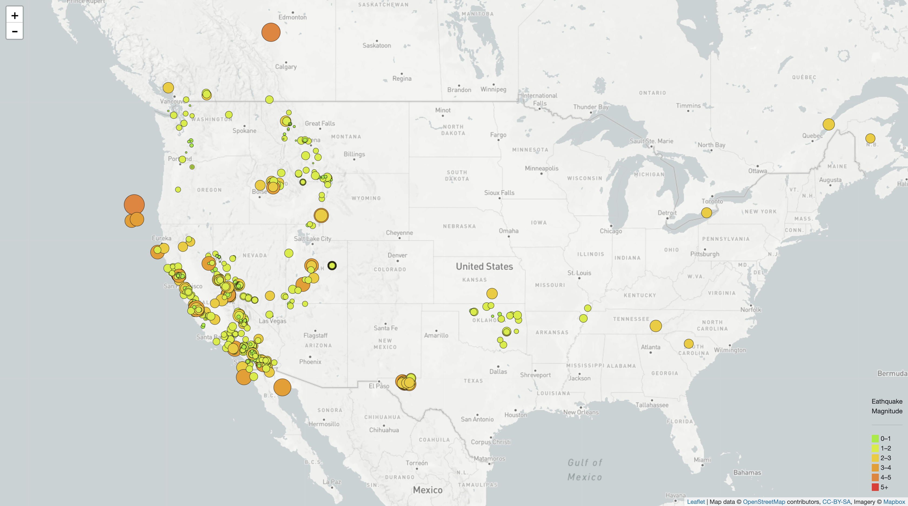

# leaflet-challenge

The USGS (United States Geological Survey) is responsible for providing scientific data about natural hazards, the health of our ecosystems and environment; and the impacts of climate and land-use change. 

The USGS is interested in building a new set of tools that will allow them visualize their earthquake data. They collect a massive amount of data from all over the world each day, but they lack a meaningful way of displaying it. Their hope is that being able to visualize their data will allow them to better educate the public and other government organizations on issues facing our planet.

### Step 1: Basic Visualization

1. **Get the data set**

   The USGS provides earthquake data in a number of different formats, updated every 5 minutes. Visit the [USGS GeoJSON Feed](http://earthquake.usgs.gov/earthquakes/feed/v1.0/geojson.php) page and select the meanful data set to visualize. 

2. **Import & Visualize the Data**

   Create a map using Leaflet that plots all of the earthquakes from the data set based on their longitude and latitude.

   The data markers reflect the magnitude of the earthquake by their size and and depth of the earth quake by color. Earthquakes with higher magnitudes appear larger and earthquakes with greater depth appear darker in color.

- - -

### Step 2: More Data 

Plot a second data set on the map to illustrate the relationship between tectonic plates and seismic activity. Pull in a second data set and visualize it along side the original set of data. Data on tectonic plates can be found at <https://github.com/fraxen/tectonicplates>.
